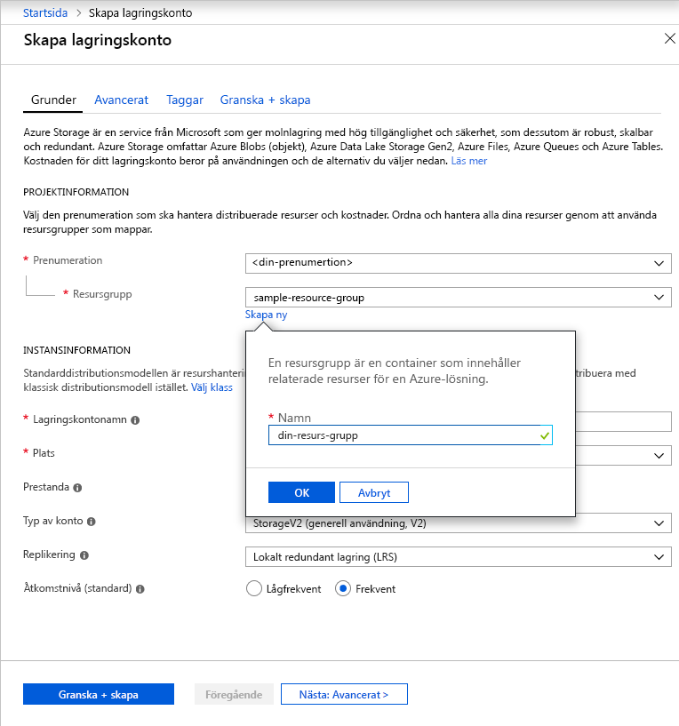

Följ de här stegen för att skapa ett GPv2-konto för generell användning i Azure-portalen:

1. Välj **Alla tjänster** i Azure-portalen. Skriv **lagringskonton** i listan över resurser. När du börjar skriva filtreras listan baserat på det du skriver. Välj **Lagringskonton**.
1. På fönstret **lagringskonton** som visas, väljer du **lägg till**.
1. Välj den prenumeration där du vill skapa lagringskontot.
1. Under fältet **Resursgrupp** väljer du **Skapa ny**. Ange ett namn för din nya resursgrupp som du ser i följande bild.

    

1. Ange sedan ett namn för lagringskontot. Namnet du väljer måste vara unikt för Azure. Namnet måste också bestå av mellan 3 och 24 tecken långt och får bara innehålla siffror och gemener.
1. Välj en plats för ditt lagringskonto eller använd standardplatsen.
1. Lämna dessa fält med respektive standardvärde:

   |Fält  |Värde  |
   |---------|---------|
   |Distributionsmodell     |Resource Manager         |
   |Prestanda     |Standard         |
   |Typ av konto     |StorageV2 (generell användning v2)         |
   |Replikering     |Read-Access Geo-Redundant Storage (RA-GRS)         |
   |Åtkomstnivå     |Frekvent         |

1. Välj **Granska + skapa** för att granska inställningarna för ditt lagringskonto och skapa kontot.
1. Välj **Skapa**.

Mer information om typer av lagringskonton och andra inställningar för lagringskonto finns i [översikten över Azure-lagringskonton](https://docs.microsoft.com/azure/storage/common/storage-account-overview). Mer information om resursgrupper finns i [Översikt över Azure Resource Manager](https://docs.microsoft.com/azure/azure-resource-manager/resource-group-overview). 
